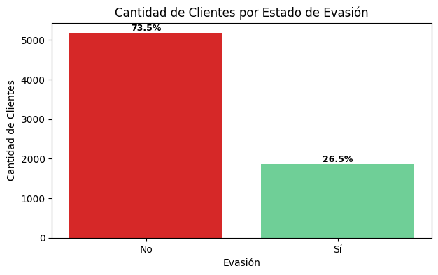
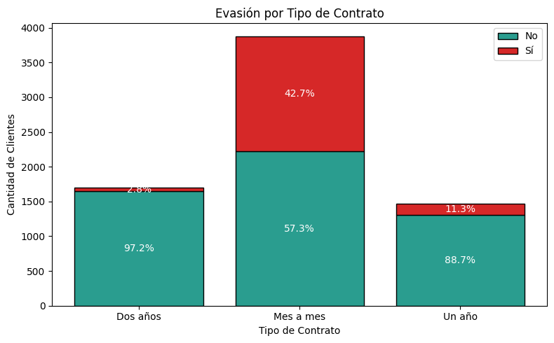
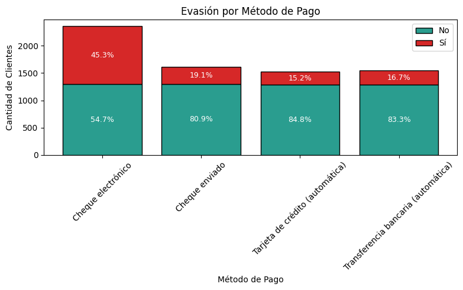
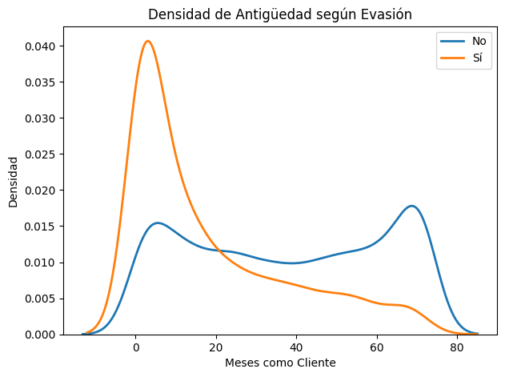
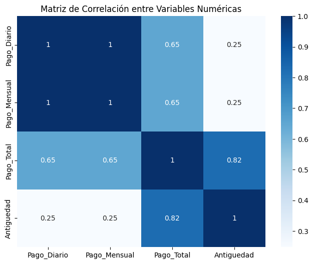

<p align="center">
  
</p>


# 📊 Telecom X – Análisis de Evasión de Clientes (Churn)

Proyecto desarrollado dentro del **desafío Telecom X** del programa **ONE Oracle Next Education**.  
Incluye extracción desde API, proceso ETL, limpieza, análisis exploratorio, visualizaciones y generación de insights estratégicos.

---

## 🧾 Índice

- [📌 Estado del proyecto](#-estado-del-proyecto)
- [🎯 Propósito del análisis](#-propósito-del-análisis)
- [🗂 Estructura del proyecto](#-estructura-del-proyecto)
- [📊 Ejemplos gráficos e insights](#-ejemplos-gráficos-e-insights)
- [🧠 Principales descubrimientos](#-principales-descubrimientos)
- [🚀 Instrucciones para ejecutar](#-instrucciones-para-ejecutar)
- [📝 Recomendaciones finales](#-recomendaciones-finales)
- [👩‍💻 Autoría](#-autoría)

---

## 📌 Estado del proyecto
✅ Proyecto finalizado  
Incluye extracción desde API, proceso ETL completo, análisis exploratorio y conclusiones estratégicas.

---

## 🎯 Propósito del análisis

El objetivo central es comprender **qué variables influyen en la evasión de clientes** y detectar patrones clave para la toma de decisiones.

Se busca:

- Identificar factores asociados al churn  
- Visualizar tendencias  
- Generar insights estratégicos  
- Proponer mejoras basadas en datos  

📌 Este proyecto simula el rol de una analista de datos en un contexto real de negocio, aplicando técnicas de **ETL**, **EDA** y **comunicación de insights** para apoyar la toma de decisiones estratégicas.

---

## 🗂 Estructura del proyecto

```text
telecom-x-churn/
│
├── data/
│   └── raw/
│       └── TelecomX_Data.json       # Datos obtenidos desde la API
│
├── images/                          # Gráficos generados durante el EDA
│   ├── evasion.png
│   ├── genero_evasion.png
│   ├── contrato_evasion.png
│   ├── metodopago_evasion.png
│   ├── serviciointernet_evasion.png
│   ├── antiguedad_evasion.png
│   ├── pagototal_evasion.png
│   ├── pago_mensual.png
│   ├── correlacion_numericas.png
│   ├── correlacion_servicios.png
│   └── relacion_diario_evasion.png
│
├── notebooks/
│   └── TelecomX_LATAM.ipynb          # Notebook principal con ETL y EDA
│
├── LICENSE                         # Licencia MIT del proyecto
└── README.md                      # Documentación del proyecto
```
---

## 📊 Ejemplos gráficos e insights

✔ **Distribución general de Evasión**  
Proporción entre clientes que permanecen en la empresa y aquellos que cancelan el servicio.    


✔ **Contrato y evasión**  
El tipo de contrato muestra una fuerte relación con la evasión, destacándose el contrato mes a mes como el de mayor churn.  


✔ **Método de pago**  
Los clientes que utilizan cheque electrónico presentan una tasa de evasión significativamente más alta que quienes usan métodos automáticos.  


✔ **Servicio de internet**  
La fibra óptica concentra la mayor proporción de clientes que abandonan, en comparación con DSL y clientes sin servicio.  


✔ **Antigüedad**  
Los clientes con menor tiempo en la empresa tienden a evadirse con mayor frecuencia.  


✔ **Correlación entre variables numéricas**  
Las variables numéricas no presentan correlaciones fuertes entre sí, lo que sugiere que la evasión no depende exclusivamente de factores económicos.  


---

## 🧠 Principales descubrimientos

- El tipo de contrato es el predictor más fuerte de evasión  
- El cheque electrónico presenta la tasa más alta de churn  
- La fibra óptica muestra mayor evasión que DSL  
- Los clientes con menor antigüedad abandonan más  
- El género no presenta diferencias relevantes  

---

## 🚀 Instrucciones para ejecutar

### 1️⃣ Clonar el repositorio

```bash
git clone https://github.com/belubullorini/telecom-x-churn.git
```

### 2️⃣ Instalar dependencias

```bash
pip install pandas matplotlib seaborn requests
```

### 3️⃣ Ejecutar el notebook

Podés ejecutarlo en **Google Colab** o **Jupyter Notebook** siguiendo este flujo:

- Extracción de datos desde la API  
- Limpieza y transformación  
- Análisis exploratorio (EDA)  
- Visualizaciones  
- Conclusiones

📌 **Nota sobre rutas de archivos** 
Si ejecutás el proyecto en Google Colab, el archivo JSON debe cargarse en el entorno /content/.
Se recomienda ejecutar el notebook en Google Colab para evitar posibles inconvenientes con las rutas de archivos y la carga del JSON.
Si lo ejecutás en local, asegurate de mantener la estructura de carpetas data/raw/ y ajustar el path según corresponda.

---

## 📝 Recomendaciones finales

- Incentivar contratos de mayor duración  
- Promover métodos de pago automáticos  
- Revisar calidad del servicio de fibra óptica  
- Implementar programas de retención temprana  
- Segmentar campañas según riesgo de churn  

---

## 👩‍💻 Autoría

Proyecto realizado por **M. Belén Bullorini**, en el marco del programa  
**ONE Oracle Next Education**.

🔗 LinkedIn: https://www.linkedin.com/in/belenbullorini  
🔗 GitHub: https://github.com/belubullorini


